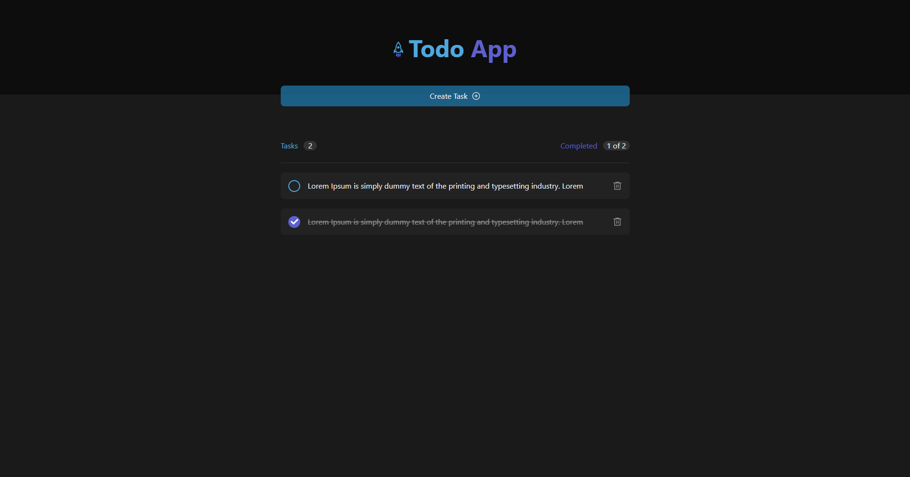
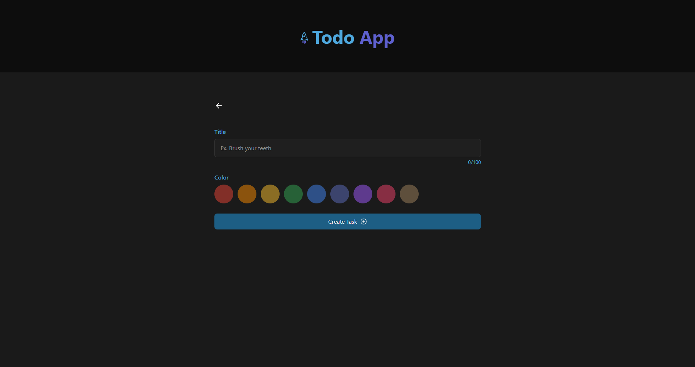
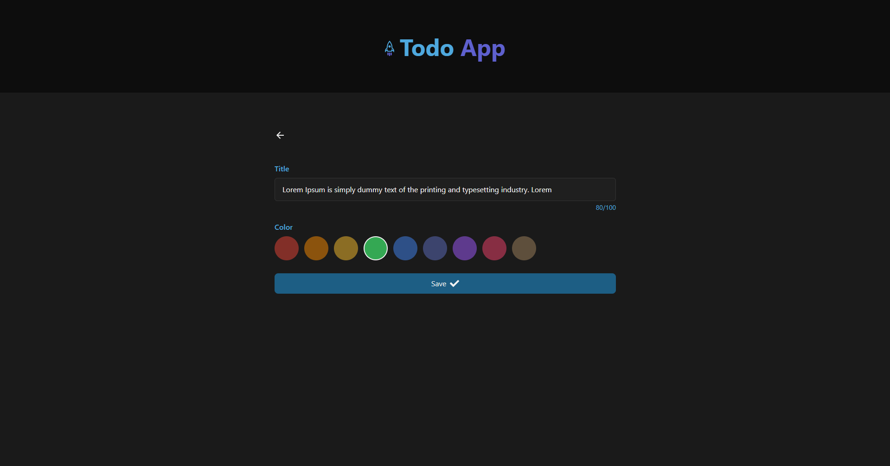
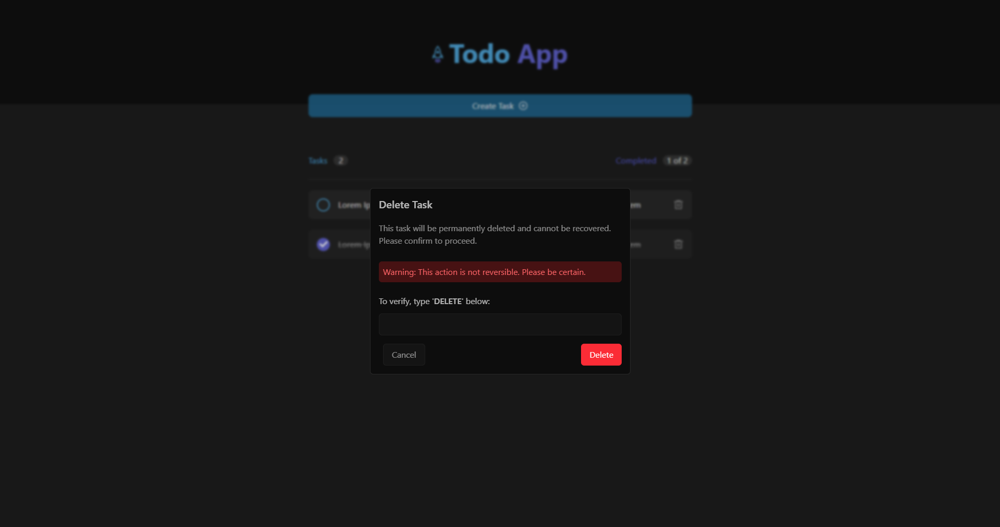

# 📝 Nooro Todo App

A modern full-stack Todo application built with **Next.js** (App Router) on the frontend and **Express.js** with **Prisma** and **MySQL** on the backend. This repository contains the **frontend** only. The backend is hosted separately.

## 😎 Screenshots

<div style="display: flex; gap: 10px; margin-bottom: 10px; justify-content: center;">
  
  
</div>

<div style="display: flex; gap: 10px; margin-bottom: 10px; justify-content: center;">
  
  
</div>

## 🚀 Features

- 🧾 Create, update, and delete tasks
- 🎨 Task color tagging
- ✅ Completion toggling
- ⚡ Clean and responsive UI
- 🌙 Dark mode supported

## 🖥️ Tech Stack

### Frontend

- [Next.js](https://nextjs.org/) (App Router)
- [TypeScript](https://www.typescriptlang.org/)
- [Tailwind CSS](https://tailwindcss.com/)
- [React Icons](https://react-icons.github.io/react-icons/)

## 📦 Getting Started

### 1. Clone the Repository

```bash
git clone https://github.com/mistrypavankumar/nooro-todo-app.git
cd nooro-todo-app
```

### 2. Install Dependencies

```bash
npm install
```

### 3. Environment Setup

Create a `.env.local` file in the root with:

```env
NEXT_PUBLIC_API_BASE_URL=http://localhost:5000
```

> ⚠️ Replace the URL with your actual backend URL if hosted elsewhere.

### 4. Run the Development Server

```bash
npm run dev
```

## 📁 Project Structure

```
nooro-todo-app/
├── app/                # Next.js App Router Pages
├── components/         # Reusable Components
├── lib/                # Utility Functions
├── services/           # API Calls
└── public/             # Static Assets
```

## 📬 API Reference

> These routes are handled by the separate **backend** repository.

| Method | Endpoint     | Description     |
| ------ | ------------ | --------------- |
| GET    | `/tasks`     | Get all tasks   |
| GET    | `/tasks/:id` | Get task by ID  |
| POST   | `/tasks`     | Create new task |
| PUT    | `/tasks/:id` | Update a task   |
| DELETE | `/tasks/:id` | Delete a task   |

## 📂 Backend Repository

👉 The backend source code is available here: [Nooro Todo App Backend](https://github.com/mistrypavankumar/nooro-todo-app-backend)

## 📺 Tutorial
[](https://youtu.be/9s4axlOQw2o?si=-P4g4yoDKULAEvmN)

## 🙋‍♂️ Author

**Pavan Kumar Mistry**

- 📧 mistrypavankumar2304@gmail.com
- 🌐 [Portfolio](https://pavankumarmistry-portfolio.vercel.app)
- 🔗 [LinkedIn](https://linkedin.com/in/pavan-kumar-mistry-5067b21b1)
- 🐙 [GitHub](https://github.com/mistrypavankumar)

## 📄 License

This project is licensed under the [MIT License](LICENSE).
